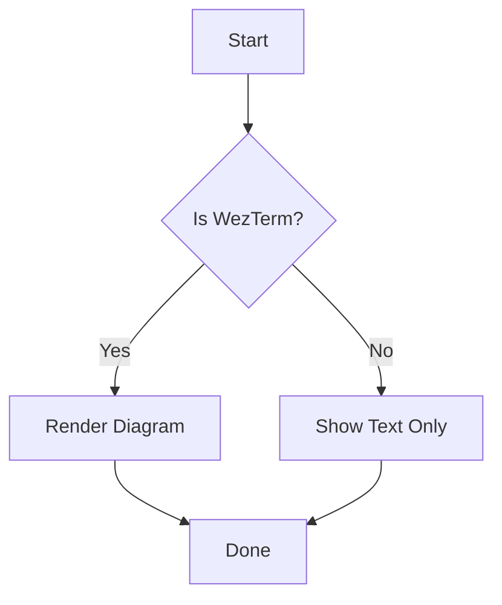
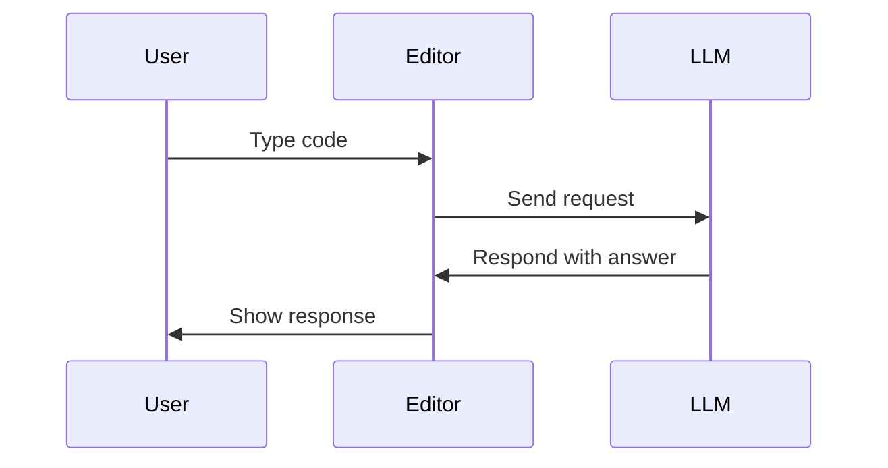
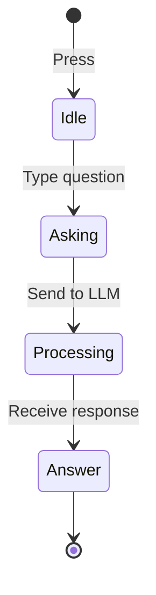

# Mermaid Diagram Example

This file demonstrates Mermaid diagram rendering in WezTerm.

## Simple Flowchart

## Sequence Diagram

## State Diagram

## How to View

1. **In WezTerm (required):**
   - Open this file: `nvim docs/examples/markdown/mermaid-example.md`
   - Diagrams appear as inline images
   - Mermaid syntax rendered in terminal preview

2. **In iTerm (not supported):**
   - Open this file: `nvim docs/examples/markdown/mermaid-example.md`
   - Diagrams show as text (Mermaid code blocks)
   - No image preview (iTerm doesn't support terminal graphics)

**Note:** Mermaid only works in WezTerm due to image protocol support. See `docs/plugins/markdown-images.md` for details.