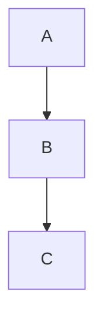

# Markdown + Images Plugin

## Purpose
Rich markdown rendering with image preview, Mermaid diagrams, and syntax highlighting. Only in WezTerm (conditional load).

## Plugins involved
1. **render-markdown** (`lua/angel/plugins/tools/markdown.lua`) - Markdown rendering
2. **image.nvim** (`lua/angel/plugins/tools/image.lua`) - Image preview
3. **magick-rock** (`lua/angel/plugins/tools/magick-rock.lua`) - LuaRocks for ImageMagick

## Load Triggers
- **render-markdown**: `event = "VeryLazy"`, `ft = { "markdown", "vimwiki" }`
- **image.nvim**: `cond = is_wezterm()` (only in WezTerm)
- **magick-rock**: `cond = is_wezterm()` (only in WezTerm)

## Features

### Mermaid diagrams (WezTerm only)
- **Enabled**: `mermaid.enabled = terminal.is_wezterm()` (conditional)
- **Rendering**: Inline in markdown files
- **Syntax**: ` ```mermaid ... ``` `
- **Example**: See `docs/examples/markdown/mermaid-example.md`

### Images (WezTerm only)
- **Preview**: image.nvim provides inline image preview
- **Supported formats**: PNG, JPG, SVG (terminal inline or kitty protocol)
- **Load**: Only loads when `vim.env.TERM_PROGRAM == "WezTerm"`

### Terminal detection
- **Helper**: `lua/angel/utils/terminal.lua` (is_wezterm(), is_iterm(), is_kitty())
- **Detection**: Auto-detects `WEZTERM_PANE` or `TERM_PROGRAM == "WezTerm"`
- **No manual config**: Works transparently (user doesn't set anything)

## Usage

### Create Mermaid diagram
```markdown

```

### Add image to markdown
```markdown

```

### Viewing result
- In WezTerm: Open markdown file → Renders as diagram/image
- In iTerm: No image preview (not supported), shows text instead

## Troubleshooting

**Issue**: Mermaid not rendering
- Check render-markdown loads: `:Lazy status render-markdown`
- Verify `mermaid.enabled = true` in config (conditional check)
- Ensure WezTerm detected: `:lua print(require("angel.utils.terminal").is_wezterm())`

**Issue**: No image preview
- Verify WezTerm detected: Terminal detection above
- Check image.nvim loads: `:Lazy status image.nvim`
- Test: `:lua print(require("angel.utils.terminal").is_wezterm())` should return `true`

**Issue**: Mermaid rendering failure
- Check magick-rock loads: `:Lazy status magick-rock`
- Verify ImageMagick installed via LuaRocks (magick rock)
- Ensure render-markdown config has `mermaid.enabled = terminal.is_wezterm()`

## Notes

**WezTerm vs iTerm detection** (automatic):
- `vim.env.TERM_PROGRAM == "WezTerm"` (primary check)
- `vim.env.WEZTERM_PANE` (primary alternative)
- No configuration needed - works transparently

**Conditional loading (optimization)**:
- In iTerm: plugins don't load (no startup impact)
- In WezTerm: plugins load when needed (mermaid, images)
- See docs/audit/SLICE10-REPORT-FINAL.md for optimization details

---

## Links
- **Examples**: See `docs/examples/markdown/mermaid-example.md`, `docs/examples/markdown/images-example.md`
- **Configuration**: See `lua/angel/plugins/tools/markdown.lua` (render-markdown)
- **Helper**: `lua/angel/utils/terminal.lua` (is_wezterm function)
- **Related**: `docs/TERMINAL_SUPPORT.md` (terminal detection docs)